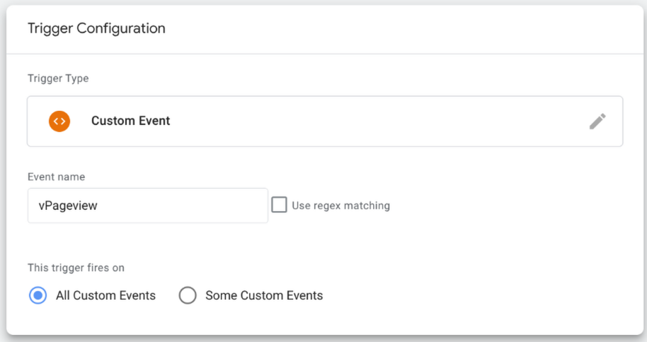
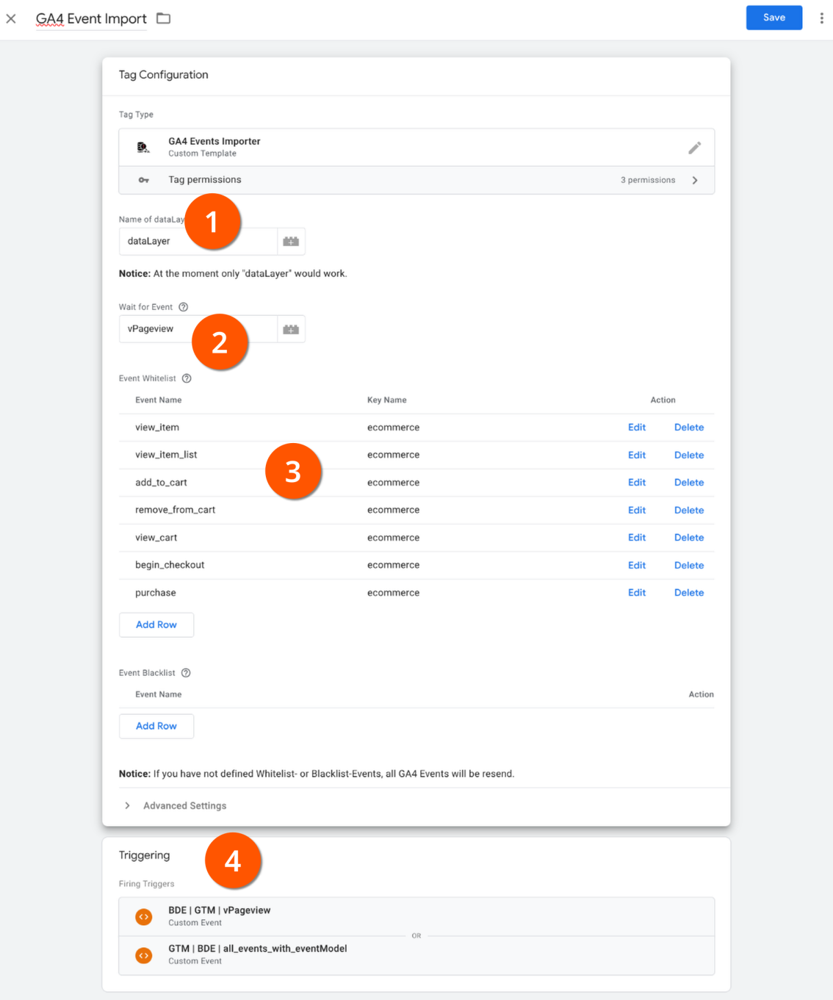

# GA4 Event Importer for Google Tag Manager

## Table of Contents

- [What is it for? - General Information](#what-is-it-for----general-information)
- [Usage](#usage)
- [Contact and more Information](#contact-and-more-information)
- [Changelog](#changelog)

---

## What is it for? - General Information

This is a Google Tag Manager Template (client-side) to look for GA4-formated Tags (these with the eventModel Object) and send's them as normal-formated GTM dataLayer Events. 
I created it because the handling with GA4 dataLayer Events is very frustrating, especially if you need these Events for other services than GA4.

---

## Usage

Go through the following steps to use the Template:

### (1) Import the Template

Download the file "template.tpl" and navigate to your GTM Container.

Click on templates and the "New" Button:

Click the 3-Point-Menu in the upper right corner and select "Import":

Save the imported Template:

### (2) Create the Trigger

If you want, you can trigger this Importer to all Events. It will look only for GA4-formated Events and ignores all the others.
It also remembers what events have been (re)sent. It saves also what dataLayer event the last was and starts from there if it is new-triggered.
If you want to make your life easy, create a trigger like this:

But if you want you can configure triggers just for the neccesary states.
In this case we need one or two Trigger:
1. One Trigger for all Events with an existing eventModel Object:
   
   *You need to create a dataLayer Variable for the "eventModel" attribute.*
2. One Trigger if you want to send the events not before a specified events occurs in the dataLayer (in my case it's an event called "vPageview"):
   

### (3) Set up the Tag

Now create a new Tag and select "GA4 Event Importer" as tag type.
Let's go through the configurations options:

**(1) DataLayer Name**
The first option is for the name of your dataLayer.
You should leave it as it is. *Regarding a missing option to use variables in the Access global variables an other name than dataLayer is not possible at the moment.*

**(2) Wait for Event**
In case you want to fire the found GA4 Events not before a special event was fired in the dataLayer you can use this option.
Just specify the name of the event to waiting for.
Leave it blank if you want to fire all GA4 events as soon as they are fired.

**(3) Event White- and Blacklist**
If you want to (re)send all found GA4 events you don't need to configure a White- or Blacklist.
Otherwise you can define Event names in the Whitelist (no other events will be (re)send then).
Or you define Blacklist events that should not be (re)send (all other events will be fired then).

**(4) Define your Triggers**
See chapter before for more details.

### Review, test and Publish

Check your settings and test it using the Preview Option of the GTM.
Publish the container version ...

---

## Contact and more Information

Feel free to use or change the code. If you have suggestions for improvement, please write to me.

- **Licence:** Apache 2.0
- **Repository:** [GA4 Event Importer - Github Repository](https://github.com/Andiministrator/gtm-ga4-event-importer)

### Author and Contact

Please contact me if you found problems or have improvements:

**Andi Petzoldt**

- ☛ https://andiministrator.de
- ✉ andi@petzoldt.net
- 🧳 https://www.linkedin.com/in/andiministrator/
- 🐘 https://mastodon.social/@andiministrator
- 👥 https://friendica.opensocial.space/profile/andiministrator
- 📷 https://pixelfed.de/Andiministrator
- 🎧 https://open.audio/@Andiministrator/

---

## Changelog

- Version 1.0, *06.04.2025*
  - Initial Version of GA4 Event Importer

---
